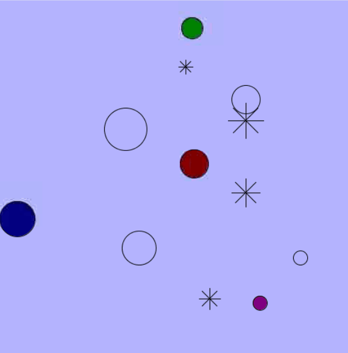

# Balls, Bubbles, and Snowflakes

The included template provides a fully working program that generates a single `Ball` object called `ball1`, and the hook to animate the ball. In this assignment you will expand upon this project to add more balls, in addition to finishing the creation of two more classes, `Bubble` and `Snowflake`.

Before you start, read [SETUP.md](SETUP.md) and make sure your development environment is working!

## Project Requirements

1. Have four balls of different sizes and colors bouncing around the screen
2. Have four bubbles of different sizes rising toward the top of the screen and reappearing at the bottom
3. Have four snowflakes of different sizes falling toward the bottom of the screen and reappearing at the top.
4. All code should be properly formatted and indented, with full documentation comments for every method. Check out the `draw()` method in `Ball.java` for an exmaple of a documentation comment.
5. A design document should be included as a PDF or PNG directly in the project folder that shows the UML class diagrams for your project.
   
**What it should look like**

The expecation is that you will complete everything required for a Proficient using ONLY our CS Awesome textbook and your own knowledge. Using **any other source** for that material will be treated as academic dishonesty. NO Google, NO AI, NO Youtube. You can ask me or classmates for *hints*, but only hints, and you should not be looking at each other's code during this part of the assessment. Tutors, parents, siblings,  are forbidden for this portion of the project.

You should approach the project in the following order:

1) Read the `Sketch.java` file to understand how a processing sketch works.
   
2) Read the `Ball.java` file to understand how the `Ball `class works and all of the methods you have to interact with it. Maybe leave some (non-documentation) comments for yourself to understand it (this is the equivalent of TAPping code!)
   
3) In `Sketch.java` add code to create and draw four different balls, all with different sizes and colors, by using the `Ball` class appropriately.
   
4) Go to `Bubble.java`, remove the comment that surrounds the entire class to enable it, and complete the class. There are hints in the comments, and since bubbles are pretty similar to balls, you should be able to use the `Ball` class to help you with this process.
   
5) In `Sketch.java`, add the code to get your four bubbles working.
   
6) Open `Snowflake.java`, remove the comment that surrounds the entire class to enable it, and complete the class. This one is much less complete, with only the `draw()` method provided. You will need to figure out the rest of the class yourself, again using `Ball` and `Bubble` to help you out.

7) In `Sketch.java`, add code to get your four snowflakes working.
   
8) Create UML Class diagrams for all classes in the project, as instructed in class.

Once you have completed all of these tasks, you have created a project that can earn a proficient. The expectation is that you will create a commit at this point so that I can easily rewind your project to this point. Before committing, please make sure to right click and choose "Format" to make sure your code is clearly formatted.

---

In order to extend into Accomplished/Exemplary land, you will need to add your own spin on things, with full documentation of your process. This documentation should include: documentation comments for any new method, UML Class Diagrams for any new classes, in-code citations for any code or learning resources you found online OR in person (you can cite friends, me, etc), AND detailed explanations of what is happening in your code. If you use ChatGPT or another AI to generate code, you must share the full transcript.

Here are a few ideas, but go your own way.

1) Use random numbers to generate your balls, bubbles, and/or snowflakes rather than picking the sizes manually. The processing `random()` method can help with this, feel free to search that up in the Processing Reference. You could also use the `Math.random()` method provided directly by java to do this.
   
2) Read about java **arrays** or **ArrayLists** and use them to hold your four (or more!) snowflakes, bubbles, and balls rather than individual variables. You can save even more code in that case by using **for-each loops**.
   
3) Make it so if you hover your mouse pointer over a ball or bubble or snowflake, it does not move. The built in processing variables `mouseX` and `mouseY` can help with this, as well as the processing method `distance` - again, feel free to search that up in the Processing Reference.
   
4) Make it so that when you press a key on the keyboard, the balls change color, either to random colors or alternating between a list of options. The `keyPressed()` method, added to your main `Sketch.java`, can help with this. Again, search in the Processing Reference.
   
5) Add a new class that lets something else be created on the screen that you then create and animate in addition to the included objects.
   
6) Introduce *collision detection*, so that if balls run into each other they bounce off of each other.
   
7) Come up with your own thing. This is often the best choice, as it demonstrates ingenuity! Exploring Examples or the Reference on the processing website can help you come up with ideas!

## A note about academic honesty

I have already address the rules for the main portion of the project above.

For extensions, you will likely need to add things. I will be looking for clear evidence that anything you add from this list, or on your own, you figured out at least partially yourself. That doesn't mean you can't search things on the internet or talk to your peers about ideas, because that is part of learning new things, but the expectations is that it will be at least partially your own work in the end. Sources must be cited and how you used them explained. If any code is copy-and-pasted you either need to make sure its clear you understand what it is doing OR state in a comment that you don't understand what it does and you just used it to get it working, so that I can evaluate it fairly. Sometimes we do use code we don't understand - that's abstraction! - but you should not pretend otherwise.

If I suspect that these rules have not been followed, and that you are trying to pass the work of others off as your own, you will earn a maximum grade of a Proficient and the traditional consequences of academic dishonesty may follow.

Getting a 6 or a 7 is designed to be challenging. If you found a source that made it easy, you probably cheated. For this reason, I strongly recommend against ChatGPT and other AI tools, at least not until you have made it most of the way through solving a problem. It's too easy for it to do all the work, and this is not a "prompting ChatGPT" class.